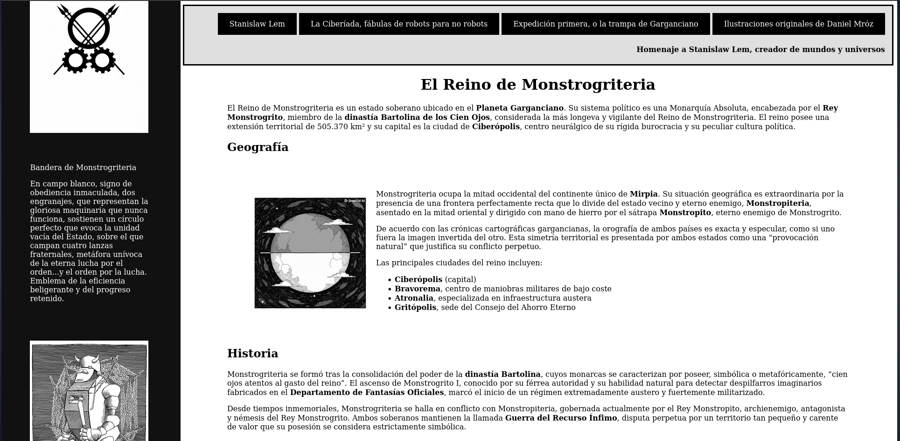

# TRABAJOINDIV01

# 📷 Proyecto TRABAJOINDIV01

**TRABAJOINDIV01** es una página web estática (GitHub Pages) desarrollada para presentar un país imaginario. Está construida con HTML y CSS.

## 🧭 Descripción del proyecto

Este sitio web tiene como objetivo mostrar una página sobre un país imaginario, con una navegación sencilla, un diseño limpio y enfocado en la experiencia del usuario:

- Página de inicio / presentación   
- Diseño responsive para que funcione bien en móviles y ordenadores  
- Estética minimalista para destacar las imágenes  

## 🛠️ Tecnologías usadas

- HTML5  
- CSS3 (uso de Flexbox)  
- GitHub Pages para el despliegue  

## 🚀 Cómo ver el sitio

Puedes ver la página en vivo aquí:  
[https://gzifoto-spec.github.io/TRABAJOINDIV01/]

